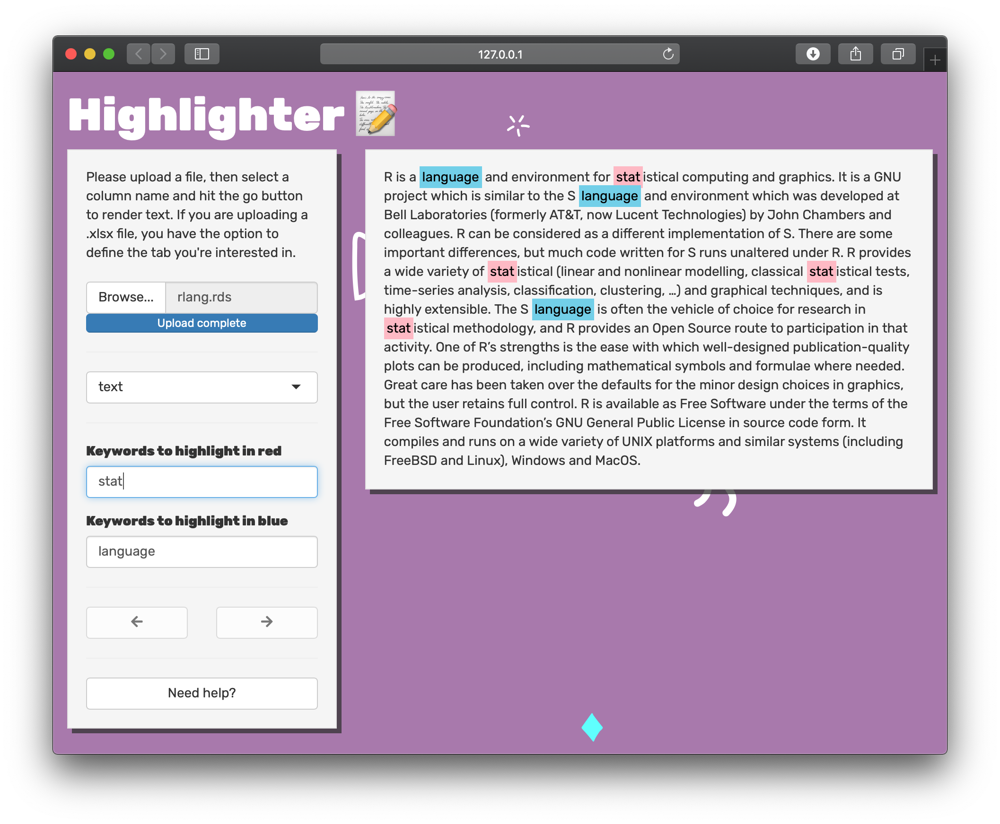

<!-- README.md is generated from README.Rmd. Please edit that file -->

# highlighter

<!-- badges: start -->

<!-- badges: end -->

The goal of highlighter is to make reading free text easier. Often
times, you are only interested in finding specific keywords in a giant
free text field. The highlighter app lets you upload a dataset and start
highlighting keywords using the
[`marker`](https://github.com/JohnCoene/marker) package.

A demonstration of the app can be found
[here](https://r4fun.dev/shiny/highlighter/). Please keep in mind that
this demo is run on a cheap server, so you cannot load large datasets on
this demo.

<!-- -->

## Installation

To run this app locally, you need to:

  - clone the repository
  - restore the `renv.lock` file
  - run the app

Do this all by running the following in your terminal:

``` zsh
git clone https://github.com/r4fun/highlighter.git
cd highlighter/
R -e 'renv::restore(confirm = FALSE); shiny::runApp()'
```

Keep in mind that this app was built on R 4.0.2, `renv` will let you run
on a different version but will give you a warning.
